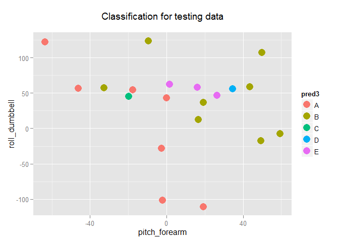

# Practical Machine Learning - Project Writeup
Yilun Zhang  
Sunday, November 09, 2014  


```r
training <- read.csv("pml-training.csv")
testing <- read.csv("pml-testing.csv")
```


```r
library(caret)
```

```
## Loading required package: lattice
## Loading required package: ggplot2
```

```r
library(nnet)
library(pROC)
```

```
## Type 'citation("pROC")' for a citation.
## 
## Attaching package: 'pROC'
## 
## The following objects are masked from 'package:stats':
## 
##     cov, smooth, var
```

## Exploratory Analysis and Preprocessing

Check missing values in the data. Remove columns with more than 10,000 missing values.


```r
training2 <- training[,colSums(is.na(training))<10000]
```

Check blank values in the data. Remove columns with more than 10,000 blanks.


```r
blankValues <- apply(training2,2,function(x) sum(x == ""))
training3 <- training2[names(blankValues[blankValues < 10000])]
```

By looking at the first few columns, I noticed that some of them are information columns, so I decided to remove them from the following analyses (first 5 columns).


```r
training4 <- training3[,-c(1:5)]
```

Up to this point, we have done all the data cleaning work and we will start our analysis. We will then separate the training set into two sets: model fitting set and prediction accuracy checking set. The purpose for separating the training set is that, the given test set doesn't have the classe column, so it is beneficial for us to use part of the training set as a test set to calculate the accuracy of our model prediction.


```r
inTrain <- createDataPartition(y=training4$classe,p=0.9,list=F)
train <- training4[inTrain,]
check <- training4[-inTrain,]
```

This marks the end of data cleaning, and we will move on to the model construction.

## Model Construction and Accuracy Analysis

#### 1st Model

The first model I come up with is the decision trees model, the following is the model fitting and prediction accuracy analysis.


```r
modFit1 <- train(classe~.,data=train,method="rpart")
table(predict(modFit1,check),check$classe)
```

```
##    
##       A   B   C   D   E
##   A 514 150 164 139  54
##   B   5 133  11  68  52
##   C  39  96 167 114  95
##   D   0   0   0   0   0
##   E   0   0   0   0 159
```

```r
p1 <- predict(modFit1,check)
round(table(p1,check$classe)/rowSums(table(p1,check$classe))*100,digit=2)
```

```
##    
## p1       A      B      C      D      E
##   A  50.34  14.69  16.06  13.61   5.29
##   B   1.86  49.44   4.09  25.28  19.33
##   C   7.63  18.79  32.68  22.31  18.59
##   D                                   
##   E   0.00   0.00   0.00   0.00 100.00
```

```r
sum(predict(modFit1,check)==check$classe)/length(check$classe)
```

```
## [1] 0.4964286
```

```r
pred1 <- predict(modFit1,testing)
```

#### 2nd Model

The second model I come up with is the multinomial classification using the generalized linear model. The following is the model fitting and prediction accuracy analysis.


```r
modFit2 <- multinom(classe~.,data=train)
```

```
## # weights:  280 (220 variable)
## initial  value 28425.892409 
## iter  10 value 22986.951066
## iter  20 value 20072.095293
## iter  30 value 18991.764081
## iter  40 value 18042.788562
## iter  50 value 17539.023397
## iter  60 value 17115.886557
## iter  70 value 16773.240127
## iter  80 value 16598.499759
## iter  90 value 16479.095498
## iter 100 value 16354.338465
## final  value 16354.338465 
## stopped after 100 iterations
```

```r
table(predict(modFit2,check),check$classe)
```

```
##    
##       A   B   C   D   E
##   A 454  66  25  71  33
##   B  19 237  46   6  54
##   C  57  35 215  39  24
##   D  28  15  32 191  33
##   E   0  26  24  14 216
```

```r
p2 <- predict(modFit2,check)
round(table(p2,check$classe)/rowSums(table(p2,check$classe))*100,digit=2)
```

```
##    
## p2      A     B     C     D     E
##   A 69.95 10.17  3.85 10.94  5.08
##   B  5.25 65.47 12.71  1.66 14.92
##   C 15.41  9.46 58.11 10.54  6.49
##   D  9.36  5.02 10.70 63.88 11.04
##   E  0.00  9.29  8.57  5.00 77.14
```

```r
sum(predict(modFit2,check)==check$classe)/length(check$classe)
```

```
## [1] 0.669898
```

```r
pred2 <- predict(modFit2,testing)
```

#### 3rd Model

The third model I come up with is the k-th nearest neighbour model. The following is the model construction and accuracy calculation.


```r
modFit3 <- train(classe~.,data=train,method="knn")
table(predict(modFit3,check),check$classe)
```

```
##    
##       A   B   C   D   E
##   A 545  14   1   3   0
##   B   3 347   9   1   5
##   C   4  12 321  15   1
##   D   6   5   7 302   8
##   E   0   1   4   0 346
```

```r
p3 <- predict(modFit3,check)
round(table(p3,check$classe)/rowSums(table(p3,check$classe))*100,digit=2)
```

```
##    
## p3      A     B     C     D     E
##   A 96.80  2.49  0.18  0.53  0.00
##   B  0.82 95.33  2.47  0.27  1.10
##   C  1.13  3.40 90.93  4.25  0.28
##   D  1.82  1.52  2.73 91.52  2.42
##   E  0.00  0.29  0.57  0.00 99.14
```

```r
sum(predict(modFit3,check)==check$classe)/length(check$classe)
```

```
## [1] 0.9484694
```

```r
pred3 <- predict(modFit3,testing)
```

## Discussion

In the last section, we have created 3 models:

1. Classification trees 
2. Generalized linear model
3. K-th nearest neighbour

By judging the performance with the prediction accuracy, k-th nearest neighbour beats the other two with an accuracy of 94.6% versus 52.3% for classfication tree and 63.7% for glm.

Therefore, I will be using the knn model for predicting the classe in testing set.

Now, let's take a look at the variable importance in the knn model (which is generated by using the ROC curve in pROC package).


```r
imp <- varImp(modFit3)$importance
imp$sum <- imp$A + imp$B + imp$C + imp$D + imp$E
imp <- imp[order(-imp$sum),]
head(imp,n=10)
```

```
##                           A        B        C         D        E      sum
## pitch_forearm     100.00000 62.80252 71.92727 100.00000 66.49141 401.2212
## roll_dumbbell      51.80676 63.74293 84.54617  84.54617 58.87260 343.5146
## magnet_arm_x       77.94369 53.54118 55.40310  77.94369 65.55007 330.3817
## accel_forearm_x    81.20308 50.85787 63.52041  81.20308 46.68260 323.4670
## magnet_belt_y      67.52690 60.51488 61.65972  62.31998 67.52690 319.5484
## magnet_arm_y       76.37058 39.85164 53.58372  76.37058 67.79023 313.9667
## accel_arm_x        73.16106 51.13548 47.75555  73.16106 61.78771 307.0009
## pitch_dumbbell     53.58720 71.28341 71.28341  62.02023 47.18100 305.3552
## magnet_dumbbell_x  65.57507 65.57507 64.46142  52.03554 52.58370 300.2308
## magnet_dumbbell_y  47.21906 66.78385 66.78385  47.30067 53.37477 281.4622
```

The above table shows the top 10 important variables in the knn predictive model.


```r
qplot(pitch_forearm,roll_dumbbell,colour=classe,data=train,
      main="Classification for training data\n")
```

 

```r
qplot(pitch_forearm,roll_dumbbell,colour=pred3,data=testing,size=I(5),
      main="Classification for testing data\n")
```

 

## Prediction

Below is the final prediction for the 20 cases in the testing set.

```r
pred3
```

```
##  [1] B A B A A E D B A A B C B A E E A B B B
## Levels: A B C D E
```

The following code will produce 20 files, each contains 1 single character representing the final prediction for the associated problem-id.


```r
pml_write_files = function(x){
  n = length(x)
  for(i in 1:n){
    filename = paste0("problem_id_",i,".txt")
    write.table(x[i],file=filename,quote=FALSE,row.names=FALSE,col.names=FALSE)
  }
}

setwd("predictions")
pml_write_files(pred3)
```

## Conclusion

With the application of machine learning concepts, among the 3 models applied to our data, the k-th nearest neighbour model has the best prediction result with an accuracy of 94.6%.

By submitting the predicted output files to Coursera, we have achieved an accuracy of 90% (18 correct out of 20).
